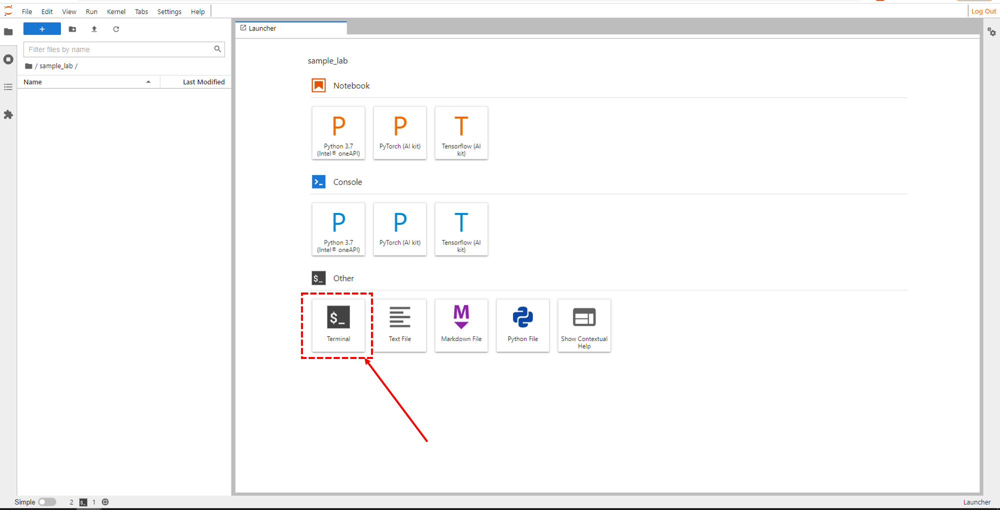
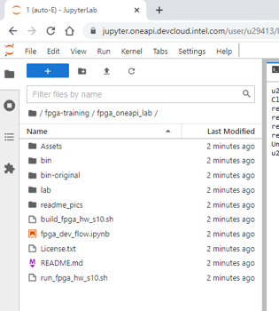
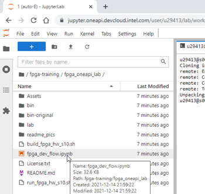

# Using FPGAs with oneAPI Lab

1. If you do not have a Intel® DevCloud account, sign up for one at this [website](https://www.intel.com/content/www/us/en/forms/idz/devcloud-registration.html?tgt=https://www.intel.com/content/www/us/en/secure/forms/devcloud-enrollment/account-provisioning.html). Use the event code from your event if you have been given one.

2. Once you have an Intel DevCloud account, go to the [Get Started page](https://devcloud.intel.com/oneapi/get_started/) and scroll to the bottom. Click on the "Sign In to Connect" button shown below that is beneath the "Connect with Jupyter* Notebook" heading.

3. You may see a screen indicating you are waiting for the kernel for Jupyter to start up. If you see this screen for more than a few minutes, go back to the [Get Started page](https://devcloud.intel.com/oneapi/get_started/) and launch JupyterLab again from the bottom of that page.

4. Once JupyterLab has launched, you will see menu options at the top. From the menu, select File -> New -> Terminal, as shown below.

5. At the prompt, clone this repository.

|  $ `git clone https://github.com/intel/fpga-training`

6. On the pane to the left in JupyterLab, browse to the ~/fpga-training/fpga_oneapi_lab/ directory, as shown below.

7. Double-click the fpga_dev_flow.ipynb file in the file browser pane to launch the Jupyter Notebook for the lab, as shown below. Work the Jupyter Notebook.

